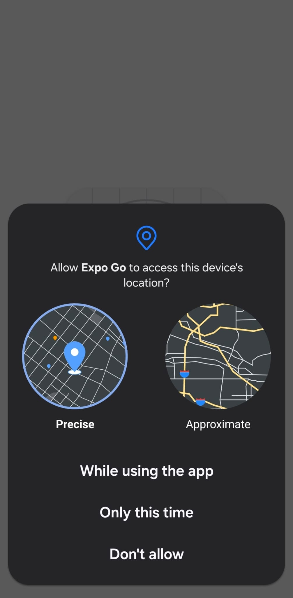
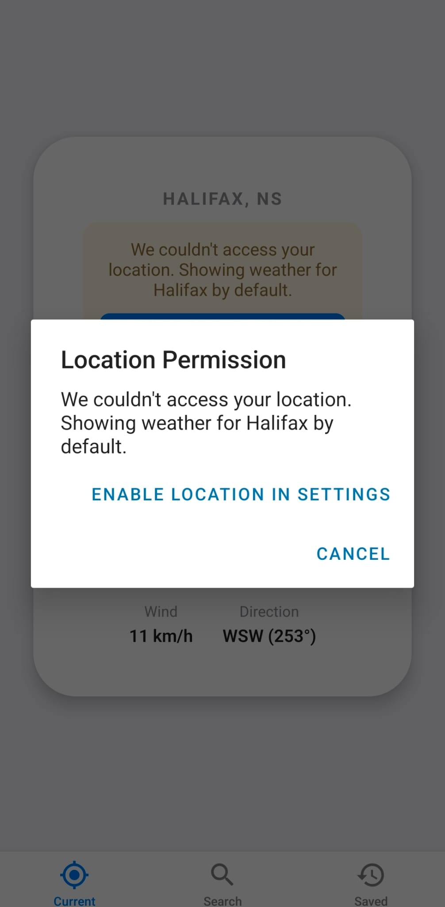
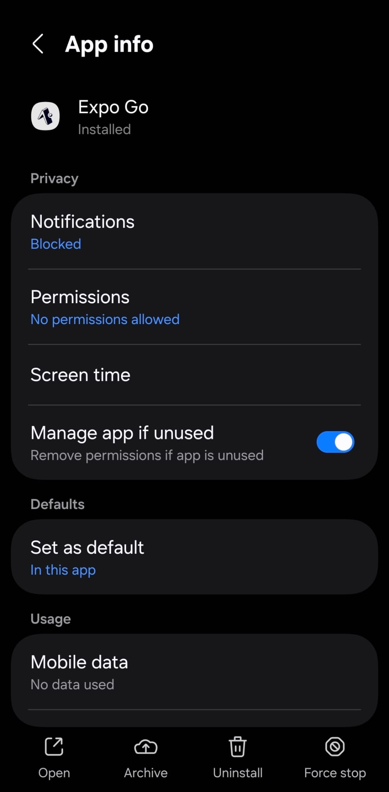
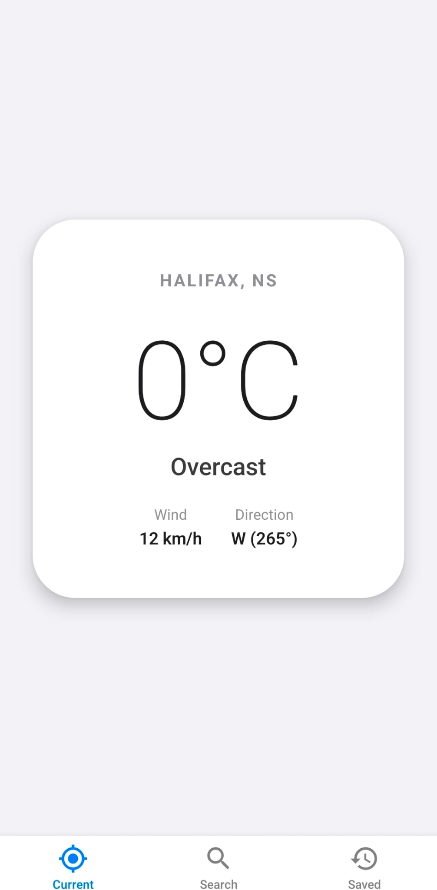
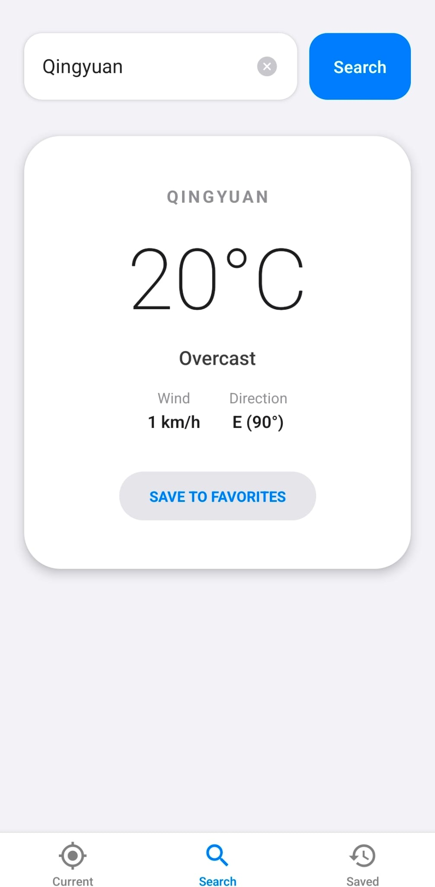
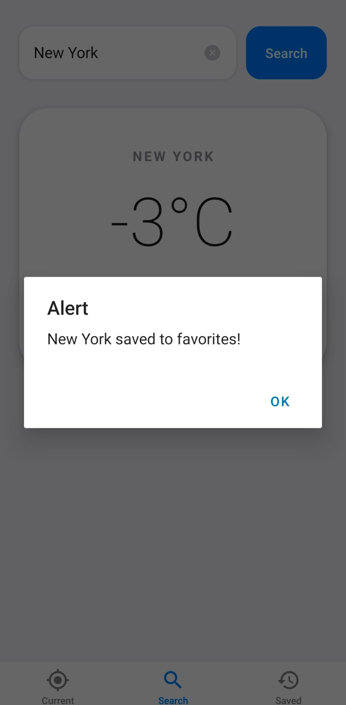
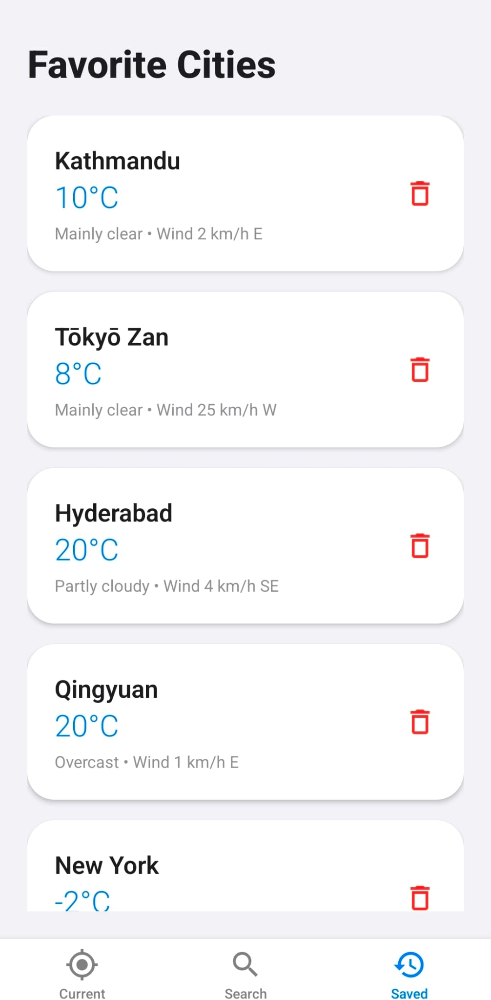
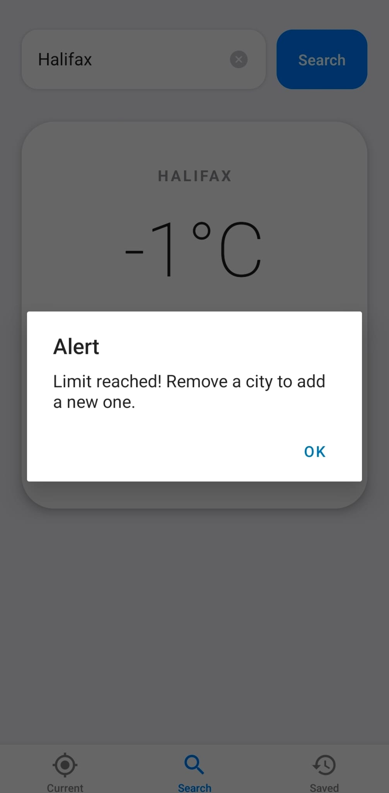
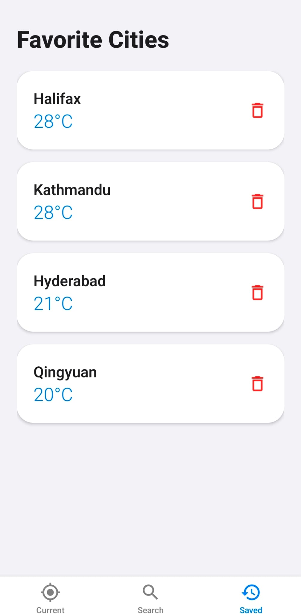

# WeatherApp

A simple Expo (React Native) weather application that shows current weather for your location, lets you search by city, and save up to 5 favorite locations using a local SQLite database.

## Features
- Current location weather with graceful fallback to Halifax, NS if permission is denied
- City search via Open‑Meteo geocoding API
- Save up to 5 favorite locations (SQLite)
- Bottom‑tab navigation across views
- Runs on Android and Web (Windows friendly)

## Tech Stack
- Expo SDK 54
- React Native 0.81 / React 19
- Navigation: `@react-navigation/*`
- Location: `expo-location`
- Persistence: `expo-sqlite` (plugin configured in `app.json`)

## Prerequisites
- Node.js 18+ (recommend 18 or 20 LTS)
- Package manager: pnpm (recommended) or npm
- Windows: PowerShell or a terminal of your choice
- Android (optional): Android Studio + emulator, or a physical device with Expo Go

Install pnpm if not already installed:

```bash
npm i -g pnpm
```

## Setup
1. Install dependencies:

    ```bash
    pnpm install
    ```

    If you prefer npm:

    ```bash
    pnpm install
    ```

2. (Optional) Install Expo Go on your Android device from the Play Store.
3. (Optional) Set up Android emulator via Android Studio (AVD Manager).

## Running
### Start the development server
```bash
pnpm start
```

This launches Expo Dev Tools. From here you can:
- Press `a` to launch Android emulator (if configured), or
- Press `w` to open the web build in your browser.


> iOS commands exist but require macOS; on Windows, use Android or Web.

## Testing on Android with Expo GO
Use Expo Go on an Android device or emulator to validate core flows. Start the dev server with `pnpm start`, then press `a` for Android or scan the QR in Expo Dev Tools.

Screenshots from the Android run:

<table>
  <tr>
    <td></td>
    <td></td>
    <td></td>
  </tr>
  <tr>
    <td></td>
    <td></td>
    <td></td>
  </tr>
  <tr>
    <td></td>
    <td></td>
    <td></td>
  </tr>
  <tr>
    <td></td>
    <td></td>
    <td></td>
  </tr>
</table>


## Permissions & Data
- Location: The app requests foreground location permission. If denied, it shows Halifax weather by default and offers a quick link to open device settings.
- Storage: Favorite cities are stored locally via `expo-sqlite`. The app enforces a limit of 5 saved locations.

## Environment Variables
No API keys are required. Weather and geocoding use Open‑Meteo public endpoints.

## Project Structure
- App entry and navigation: [App.tsx](App.tsx)
- Expo bootstrap: [index.ts](index.ts)
- Screens:
  - Current weather: [src/screens/CurrentWeather.tsx](src/screens/CurrentWeather.tsx)
  - Search by city: [src/screens/SearchWeather.tsx](src/screens/SearchWeather.tsx)
  - Saved locations: [src/screens/SavedLocations.tsx](src/screens/SavedLocations.tsx)
- Services:
  - Weather API: [src/services/weatherService.ts](src/services/weatherService.ts)
  - SQLite persistence: [src/services/dbService.ts](src/services/dbService.ts)
- Types: [src/types/weather.ts](src/types/weather.ts)
- Expo config & plugin: [app.json](app.json)

## Available Scripts
- `pnpm start`: Start Expo Dev Server
- `pnpm android`: Start on Android (emulator or connected device)
- `pnpm web`: Start web build in browser

## Troubleshooting
- Android emulator not detected:
  - Open Android Studio → AVD Manager → Start an emulator, then run `pnpm android`.
- Device not showing:
  - Ensure USB debugging is enabled and run `adb devices` to verify connection.
- Location denied:
  - Use the in‑app "Enable Location in Settings" action or manually grant permission in system settings.
- SQLite on Web:
  - Persistence is designed for native (Android/iOS). Web behavior may differ depending on browser capabilities.
- Port conflicts:
  - Stop other dev servers or change the port in Expo Dev Tools.

## Notes
- Keep Node.js within supported versions for Expo SDK 54 (18/20 LTS recommended).
- If you switch package managers, remove `node_modules` and lockfiles, then reinstall (e.g., `pnpm install`).

